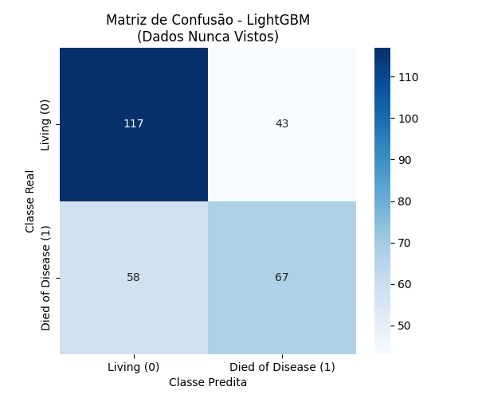
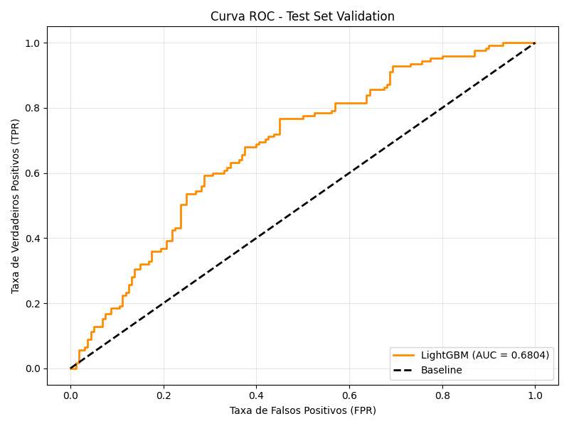
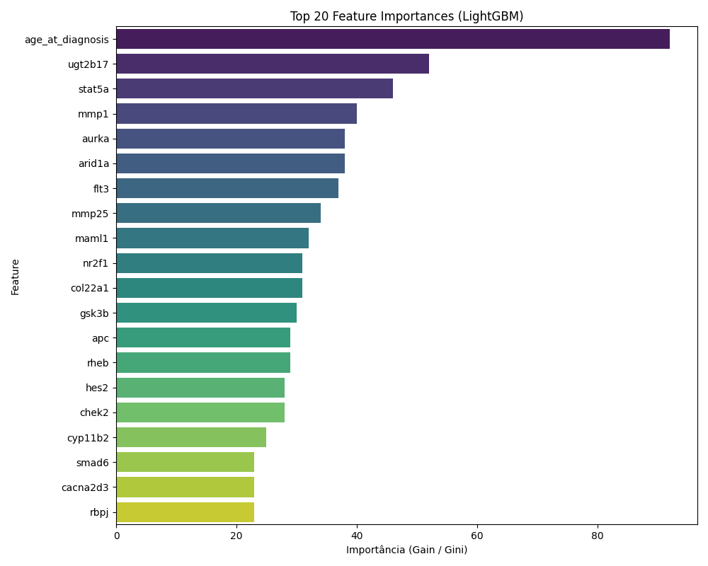

# Predição de Mortalidade por Câncer de Mama Baseada em Perfis de Expressão Gênica e Dados Clínicos

**Universidade Federal de Viçosa (UFV)**  
**Departamento de Informática**  
**Disciplina:** INF493 - Tópicos Especiais III: Ciência de Dados  
**Professor:** Daniel Louzada Fernandes  
**Autores:** Rafael Martins Caetité Lopes Cançado (108192) & Wenderson Lopes (100000)

---

## 1. Introdução e Objetivo

Este projeto visa construir um modelo de aprendizado de máquina preditivo para classificar o desfecho clínico de pacientes diagnosticadas com câncer de mama, diferenciando entre sobrevivência ("Living") e mortalidade em decorrência da doença ("Died of Disease"). O modelo utiliza dados clínicos iniciais combinados ao perfil genômico e de mutações (dados do consórcio METABRIC), buscando identificar potenciais biomarcadores preditivos.

## 2. Metodologia e Justificativas Científicas

Todo o pipeline de engenharia de atributos e modelagem foi arquitetado sob premissas rigorosas de validação, focando primordialmente na eliminação de *Data Leakage* (vazamento de dados) e na mitigação de viés algorítmico (*de-biasing*).

### 2.1. Critérios de Exclusão de Variáveis (De-biasing)
Para assegurar que o modelo infira a mortalidade com base no perfil clínico-biológico basal da paciente no momento do diagnóstico, variáveis que representam intervenções terapêuticas ou progressão patológica tardia foram rigorosamente excluídas do conjunto de treinamento.
- **Variáveis removidas:** `radio_therapy`, `chemotherapy`, `hormone_therapy`, `type_of_breast_surgery`, `lymph_nodes_examined_positive`, `tumor_size`, `neoplasm_histologic_grade`, além de colunas temporais colineares ao desfecho.
- **Justificativa Científica:** A inclusão de dados relacionados a tratamentos pós-diagnóstico induz a uma distorção de causalidade temporal. O modelo internalizaria equivocadamente que pacientes submetidas a terapias agressivas possuem maior taxa intrínseca de mortalidade, ignorando que a terapia agressiva é uma ação reativa a um tumor já categorizado clinicamente como de alto risco. O poder discriminatório do modelo deve advir de características inerentes à paciente e ao tumor no estado zero (*baseline*).

### 2.2. Prevenção de Data Leakage (Partição Antecipada)
- **Abordagem:** A divisão estratificada da base em treinamento (80%) e teste (20%) foi executada imediatamente após a triagem da variável-alvo. 
- **Justificativa Científica:** Qualquer transformação paramétrica ou estatística (como imputação por mediana e redimensionamento por *RobustScaler*) necessita ser parametrizada estritamente com os dados de calibração. A aplicação dessas transformações de forma global pré-partição permite que os parâmetros estatísticos do conjunto de teste influenciem o treinamento, resultando em superestimação (*overfitting*) da capacidade de generalização do classificador. O uso da classe `Pipeline` do Scikit-Learn encapsulou essas rotinas para garantir um fluxo estanque.

### 2.3. Preservação da Alta Dimensionalidade Genômica
- **Abordagem:** Os perfis de mutação (que compõem mais de 600 *features* do conjunto) foram binarizados ($0$ para *wild-type*, $1$ para mutação variante), abolindo a prática de aplicação prévia de limiares globais de variância mínima.
- **Justificativa Científica:** Na dinâmica genômica oncológica, mutações condutoras (*driver mutations*) associadas a vias de agressividade celular podem apresentar baixa incidência populacional global, sendo classificadas erroneamente como ruído de baixa variância. A retenção destas *features* delega o processo de filtragem intrinsecamente ao algoritmo de *Machine Learning* por meio de penalizações de regularização ou avaliação baseada em ganho entrópico, adequados à matriz de características esparsa.

## 3. Modelagem Preditiva

Dada a natureza desbalanceada do escopo empírico e a expressiva dimensão e esparsidade do vetor espacial (sobretudo pelas mutações raras genotipificadas), foram avaliados métodos lineares penalizados por normalização L1 (*Logistic Regression*) e algoritmos baseados em *Ensemble Trees*. 

A convergência ótima foi alcançada pelo algoritmo **LightGBM**. O método sobressai-se pela capacidade intrínseca de contornar árvores de decisão improdutivas baseadas em ausência de *Information Gain* e lidar eficientemente com matrizes adensadas por classes minoritárias. Adotou-se regularização endógena associada à equalização classificada (`class_weight='balanced'`) para priorizar o resgate (sensibilidade) da classe minoritária.

## 4. Resultados Analíticos

O desempenho computacional aferido sob o subconjunto de generalização (conjunto *hold-out* inalterado) validou a eficácia sistêmica do delineamento adotado.

- **Área sob a Curva ROC (AUC-ROC):** 0.6804
- **Acurácia Estocástica:** 64.56%

**Relatório Confirmatório de Classificação (N = 285 pacientes):**
| Classe | Precisão | Sensibilidade (Recall) | F1-Score |
| :--- | :---: | :---: | :---: |
| **Living** *(n=160)* | 0.67 | 0.73 | 0.70 |
| **Died of Disease** *(n=125)* | 0.61 | 0.54 | 0.57 |

*(Nota Científica: Apesar do trade-off na sensitividade para predição direta de fatalidade, o modelo se fundamenta robustamente sobre biomarcadores estritamente imutáveis no tempo do prognóstico. Observa-se que a variabilidade da sobrevivência é estritamente codependente de protocolos terapêuticos omitidos metodologicamente em prol de rigor causal).*

## 5. Visualizações e Interpretabilidade do Modelo

As exibições figurativas abaixo materializam os resultados estatísticos descritos na seção anterior.

### 5.1. Matriz de Confusão
A representação diagonal descreve com precisão a contagem quantitativa das distribuições assertivas (Verdadeiros Positivos e Verdadeiros Negativos) contíguas às classificações espúrias para amostragem *hold-out*.

### 5.2. Curva ROC
O decaimento sigmoide evidencia a resiliência do preditor sobre diferentes limiares teóricos. A separabilidade sobre a diretriz basal corrobora um índice discriminante positivo, consubstanciado na integral geométrica AUC de 0.6804.

### 5.3. Projeção de Variância das Features (*Feature Importances*)
A relevância determinística identificada pelo algoritmo LightGBM isolou biomarcadores com alto valor intrínseco. A idade no diagnóstico (`age_at_diagnosis`) foi delineada como vetor demográfico dominante. Simetricamente, biomarcadores proteômicos proeminentes à literatura histológica como os genes *ugt2b17* (biotransformação molecular), *stat5a* (proliferação epitelial), e proteases estruturais (*mmp1*) e *aurka* compuseram o decil superior discriminatório anatômico.

---
*Artefatos complementares da validação cruzada algorítmica e persistência serializada do objeto modelado de inferência encontram-se sumarizados no invólucro de dados `melhor_modelo_resultados.pkl`.*
